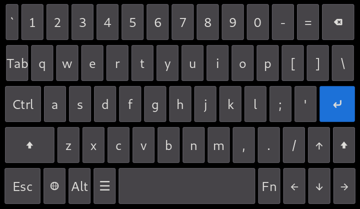
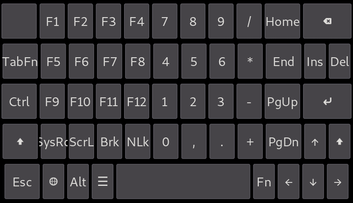

# squeekboard-pckb-layout

A terminal keyboard layout for squeekboard on the PinePhone/Librem5 with phosh. The layout is similar to the one found in [Hacker's Keyboard Android app](https://github.com/klausw/hackerskeyboard).

# How to install

Copy **us.yaml** to **~/.local/share/squeekboard/keyboards/terminal**.

# Screenshots

